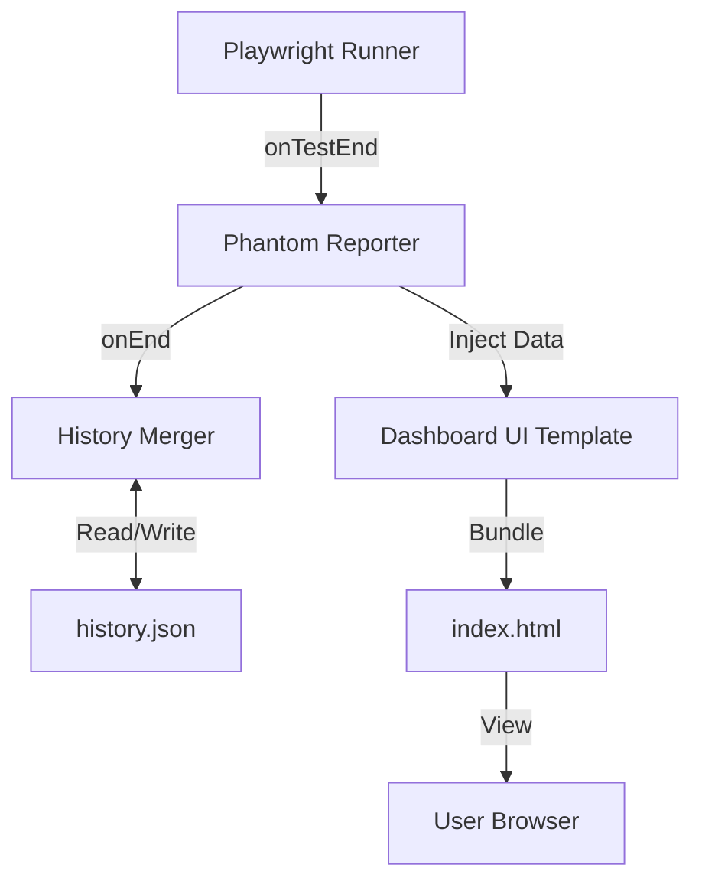

# Phantom Report Architecture 👻

Phantom Report is a modern, historical test reporter for Playwright designed for standalone use and rich data visualization.

## Architecture Overview

The project is divided into three main components:

1.  **Reporter Library (`src/reporter`)**: Implements the Playwright `Reporter` interface. It collects test results, merges them with historical data, and generates the final HTML report.
2.  **Dashboard UI (`src/App.tsx`)**: A React-based single-page application that provides the interactive dashboard. It is bundled into a single HTML file using `vite-plugin-singlefile`.
3.  **CLI Tool (`src/cli`)**: A command-line interface for generating reports from existing data and opening reports in the browser.

## Core Components

### 1. Data Collection and History

The reporter collects `TestResult` objects from Playwright events (`onTestEnd`). At the end of the run (`onEnd`), it:
- Loads existing historical data from a JSON file.
- Merges the new results into the history using the `mergeHistory` function.
- Applies retention policies (e.g., 30 days) to keep the history file size manageable.

### 2. Standalone Report Generation

The reporter uses a bundled version of the Dashboard UI as a template. It replaces a `DATA_PLACEHOLDER` in the HTML with the stringified test results and historical data. This results in a single, self-contained HTML file that can be opened directly from the file system without a local server.

### 3. Historical Analytics

The `src/core/history.ts` module contains logic for:
- **Stability Scoring**: Calculating the pass/fail ratio for individual tests over time.
- **Flaky Detection**: Identifying tests that alternate between passing and failing in recent runs.
- **Performance Tracking**: Monitoring execution time trends for the entire suite and individual tests.

## Tech Stack

- **Frontend**: React 19, Tailwind CSS 4, Recharts, Lucide React, Motion.
- **Backend/Library**: TypeScript, Playwright Reporter API, Commander (CLI).
- **Build System**: Vite, esbuild, `vite-plugin-singlefile`.

## Data Flow

## Design Principles

- **Zero Dependencies for the User**: The generated report is a single HTML file with no external dependencies.
- **Historical Context**: Every test result is presented within the context of its history to help identify trends and flakiness.
- **Performance First**: The reporter is designed to be fast and lightweight, adding minimal overhead to the test run.
